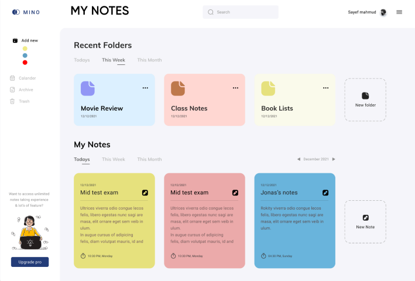

# Todo Web App

## Overview

This is a Todo Web App that allows users to manage tasks and folders. Users can create, update, delete, and organize tasks into folders. Each folder can be assigned a color, and tasks within folders can also be color-coded. The latest tasks are sorted and appear at the top. When a folder is deleted, all tasks associated with that folder are also deleted.


## Features

- **CRUD Operations**: Create, Read, Update, and Delete tasks and folders.
- **Folder Management**: Add new folders, assign colors, and organize tasks into these folders.
- **Task Management**: Add, update, delete tasks, and assign colors to tasks.
- **Task Sorting**: Latest tasks are sorted and appear at the top.
- **Folder Deletion**: Deleting a folder also deletes all associated tasks.
- **Color Customization**: Choose colors for folders and tasks.

## Technologies Used

- **Node.js**: Backend server and API.
- **JavaScript**: Client-side logic.
- **Tailwind CSS**: Styling and layout.
- **Firebase**: Realtime database and authentication.

## Installation

1. **Clone the repository**:

   ```bash
   git clone https://github.com/yourusername/todo-web-app.git
   cd todo-web-app
